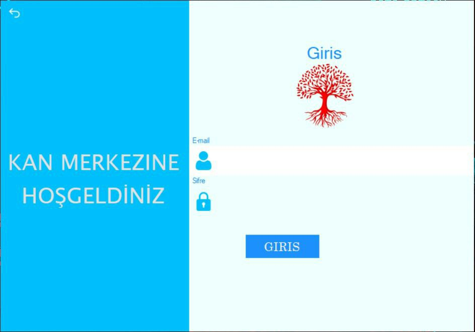
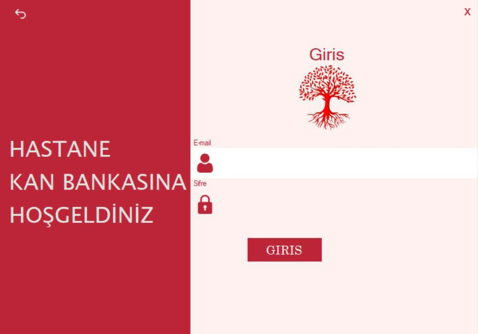
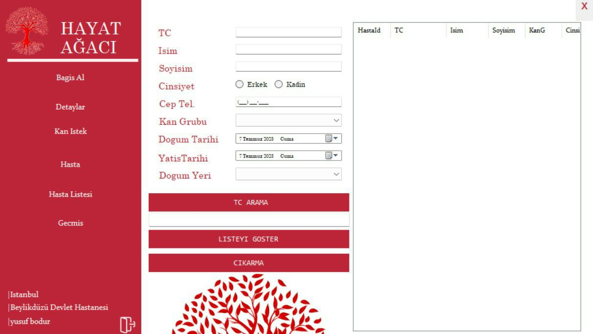

# Hayat-Agaci-(Blood-Bank-Management-System)-

Blood Bank Management is a software application developed in C# to manage blood donation and inventory in a blood bank. The application provides functionalities to record donor information, track blood units, and manage blood requests.

## Features

- Donor Management: The application allows the user to add, update, and delete donor information including personal details, contact information, and blood type.
- Blood Inventory: The user can record the details of blood units available in the blood bank, including blood type, quantity, and expiration date. The inventory is automatically updated as blood units are donated or used.
- Blood Requests: The application provides a feature to manage blood requests from hospitals or other organizations. Users can record the details of the request, check the availability of the required blood type, and assign the blood unit for the request.
- Reports: The software generates reports on blood inventory, donor statistics, and blood request history, providing valuable insights for the blood bank management.

## Usage

1. Launch the application.
2. Register donors by providing their information through the donor management interface.
3. Add blood units to the inventory along with their details, such as blood type, quantity, and expiration date.
4. To make a blood request, navigate to the blood request section, enter the required blood type and quantity, and submit the request.
5. The system will check the availability of the requested blood type and assign a compatible blood unit if available.
6. Generate reports to get insights into the blood inventory, donor statistics, and blood request history.

## Dependencies

- .NET Framework 4.7.2 or higher
- Entity Framework 6.4.4 or higher
- SQL Server (version X.X or higher) for the database

## Screenshots: Visual Overview of the Blood Bank Management System

## License
Resources/AutomationPhoto
Blood Bank Management is licensed under the MIT License. See the [LICENSE](LICENSE) file for more details.
